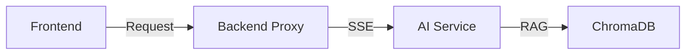

# {Feature Name} 实现方案 (Plan)

> Status: PENDING / IN_PROGRESS / DONE
> Reference Spec: [feature.spec.md](../feature.spec.md)

## 1. 核心架构设计
<!-- 简述如何实现该功能，涉及哪些组件 -->

## 2. 技术栈
- **Frontend**: Vue 3, Pinia, TailwindCSS
- **Backend API**: Spring Boot Controller
- **AI Logic**: FastAPI, LangGraph Agent
- **Infrastructure**: Redis, PostgreSQL, ChromaDB

## 3. 实现细节

### 3.1 数据流图

### 3.2 关键 API 修改
- `POST /api/v1/...`: 描述输入输出
- `GET /api/v1/sse/...`: 描述流式响应

## 4. 风险与权衡
- [ ] 性能瓶颈：AI 生成图片较慢
- [ ] 边界情况：无古诗匹配时的处理
