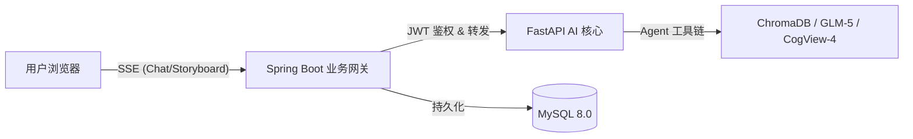

# 系统总览 (System Architecture)

> **状态**: 稳定 (Stable)  
> **版本**: 2.0  
> **更新日期**: 2026-03-06

---

## 1. 核心架构拓扑图

本项目采用典型的 **B-F-A (Browser-Frontend-AI)** 架构，前端通过后端代理网关与 AI 微服务通信。



**关键约束**：前端主流程（对话与分镜）严禁直连 AI 服务，必须经由 Backend 进行 JWT 验证和流代理转发。

---

## 2. 核心组件描述

### 2.1 前端 (Frontend)
- **核心组件**: `GenerateView.vue` (主交互)、`HistoryView.vue` (结果呈现)。
- **交互逻辑**: 实现 `detectVisualizeIntent` 意图自动识别，根据输入内容动态选择生图流或聊天流。

### 2.2 后端代理层 (Backend)
- **核心职责**: 用户身份通过 JWT 拦截器统一管理，通过 `AiProxyController` 实现 SSE 流的透传代理。
- **持久化**: 管理 `sys_generation_task` 状态机，记录最终生成结果供历史回溯。

### 2.3 AI 微服务 (AI Service)
- **引擎**: LangGraph 编排的 ReAct Agent。
- **RAG 管道**: 使用 ChromaDB 存储古诗词向量，实现精准诗句匹配与语义意境检索。

---

## 3. 核心业务流

### 3.1 对话与问答 (ReAct)
1. 前端发送 POST 请求至 Backend。
2. Backend 校验 JWT，建立与 AI Service 的代理连接。
3. Agent 根据提示词决定是否调用 `search_poetry`。
4. SSE 逐字推送响应结果。

### 3.2 诗词分镜可视化 (Storyboard)
1. 前端触发 `storyboard` 路径。
2. AI Service 首先进行 RAG 扩充（找原诗/译文）。
3. GLM 规划分镜点。
4. 逐张生图并通过 `shot_done` 事件推送，最终由 Backend 存储至 MySQL。
| `/ai/api/v1/chat/session/{id}/history` | GET | 获取会话历史 |
| `/ai/api/v1/chat/session/{id}` | DELETE | 清除会话记忆 |
| `/ai/api/v1/generate/storyboard` | POST（SSE） | ⭐ 诗词分镜多图生成 |
| `/ai/api/v1/generate/think-stream` | POST（SSE） | Legacy 思考流（旧 GLM 直调）|
| `/ai/api/v1/generate/async` | POST | Legacy 异步管道（回调模式）|
| `/ai/health` | GET | 健康检查 |

---

## 5. Frontend 意图路由逻辑

前端 `detectVisualizeIntent(text)` 自动判断用户输入意图：
- **诗句/可视化关键词** → 调用 `/ai/api/v1/generate/storyboard`
- **问答/对话** → 调用 `/ai/api/v1/chat`

规则：
1. 含关键词（生成图/画出/可视化/意境图/插画/分镜/生图等）→ 分镜
2. 10字以上中文串，无问句词（什么/如何/怎么/谁/哪等）→ 分镜
3. 否则 → 对话

---

## 6. 部署模式

### 本地开发

| 服务 | 端口 | 启动方式 |
|------|------|---------|
| MySQL | 3306 | 本机安装 |
| AI Service | 8000 | `uvicorn app.main:app --reload` |
| Backend | 8080 | `java -jar target/*.jar` |
| Frontend | 5173 | `npm run dev`（Vite 代理 /ai → 8000, /api → 8080）|

### 环境变量（AI Service）

| 变量 | 必填 | 说明 |
|------|------|------|
| `GLM_API_KEY` | ✅ | 智谱 AI API Key |
| `GLM_BASE_URL` | ✅ | GLM API Base URL |
| `GLM_MODEL` | ❌ | 使用的模型，默认 glm-4-flash |
| `GLM_TIMEOUT` | ❌ | 超时秒数，默认 60 |
| `CHROMA_PATH` | ❌ | ChromaDB 路径，默认 data/chromadb |
| `TOP_K` | ❌ | RAG 检索条数，默认 5 |
| `COGVIEW_MODEL` | ❌ | 生图模型，默认 cogview-4 |

### 环境变量（Backend）

| 变量 | 必填 | 说明 |
|------|------|------|
| `DB_URL` | ✅ | JDBC 连接串 |
| `DB_USERNAME` / `DB_PASSWORD` | ✅ | MySQL 凭据 |
| `AI_SERVICE_URL` | ✅ | Legacy 异步触发地址 |
| `AI_CALLBACK_URL` | ✅ | Legacy 回调地址 |
| `AI_CALLBACK_TOKEN` | ✅ | 回调鉴权 token |

---

## 7. 安全边界

- JWT 认证保护 Backend 用户相关接口
- AI Service 目前无鉴权（仅内网/本机访问）
- Legacy 回调接口通过 `X-Callback-Token` 防伪造

---

## 8. 相关文档

- [specs/features/poetry-visualization.spec.md](../features/poetry-visualization.spec.md)
- [specs/features/rag-pipeline.spec.md](../features/rag-pipeline.spec.md)
- [specs/architecture/data-model.md](data-model.md)
- [specs/openapi/ai-service.yaml](../openapi/ai-service.yaml)
- [specs/openapi/backend.yaml](../openapi/backend.yaml)


---

## 1. 整体架构

```
                        ┌───────────────────────────────────────┐
                        │            Browser (Vue 3)            │
                        │  ① Submit Poem  ③ Poll Task  ④ SSE   │
                        └──────────────┬───────┬───────┬────────┘
                                       │       │       │
                              HTTP REST│       │       │SSE
                                       ▼       ▼       ▼
                        ┌─────────────────────────────────────────┐
                        │         Spring Boot Backend (8080)      │
                        │  /api/v1/poetry/*   /api/v1/auth/*      │
                        │         MyBatis-Plus ↕ MySQL            │
                        └──────────────┬──────────────────────────┘
                                       │ ② async HTTP POST
                                       ▼
                        ┌─────────────────────────────────────────┐
                        │       FastAPI AI Service (8000)         │
                        │  LangGraph Agent + GLM + ChromaDB       │
                        └───────────┬─────────────────────────────┘
                                    │ ⑤ Callback POST (X-Callback-Token)
                                    └──────────────────────────────▶ Backend
```

---

## 2. 组件职责

| 组件 | 技术栈 | 核心职责 |
|------|--------|---------|
| **Frontend** | Vue 3 + Vite + TypeScript | 用户交互、任务提交、结果展示、SSE 思考流 |
| **Backend** | Spring Boot 3 + MyBatis-Plus + MySQL | REST 网关、任务状态机、AI 服务调度、用户认证 |
| **AI Service** | FastAPI + LangGraph + GLM + ChromaDB | RAG 检索、Prompt 增强、图像生成（预留）|

---

## 3. 核心数据流

### 3.1 主流程（异步任务）

```
1. 浏览器 POST /api/v1/poetry/visualize  → taskId
2. Backend 写库 PENDING，POST AI Service /generate/async
3. AI Service 后台运行：RAG → GLM → (Diffusion)
4. AI 完成后 POST /api/v1/poetry/callback（带 token）
5. Backend 更新库 COMPLETED + imageUrl
6. 浏览器轮询 /api/v1/poetry/task/{taskId} 得到结果
```

### 3.2 思考流（SSE）

```
1. 浏览器 POST /api/v1/poetry/think-stream（携带诗句）
2. Backend 作为 SSE 代理，转发给 AI Service /generate/think-stream
3. GLM 推理过程逐 token 推送给浏览器
```

---

## 4. 部署模式

### 本地开发

| 服务 | 端口 | 启动方式 |
|------|------|---------|
| MySQL | 3306 | 本机安装 |
| AI Service | 8000 | `uvicorn app.main:app` |
| Backend | 8080 | `java -jar target/*.jar` |
| Frontend | 5173 | `npm run dev` |

### 环境变量（Backend）

| 变量 | 说明 |
|------|------|
| `DB_URL` | JDBC 连接串 |
| `DB_USERNAME` / `DB_PASSWORD` | MySQL 凭据 |
| `AI_SERVICE_URL` | `/ai/api/v1/generate/async` 完整 URL |
| `AI_CALLBACK_URL` | `/api/v1/poetry/callback` 完整 URL |
| `AI_CALLBACK_TOKEN` | 回调鉴权 token |

---

## 5. 安全边界

- 回调接口通过 `X-Callback-Token` 防止外部伪造
- JWT 认证保护用户相关接口（TODO：当前仅 auth 模块实现）
- AI Service 不直接对外暴露（仅 Backend 内部调用）

---

## 6. 相关文档

- [数据模型](data-model.md)
- [Backend OpenAPI](../openapi/backend.yaml)
- [AI Service OpenAPI](../openapi/ai-service.yaml)
- [Feature: 诗词可视化](../features/poetry-visualization.spec.md)
- [Feature: RAG Pipeline](../features/rag-pipeline.spec.md)
