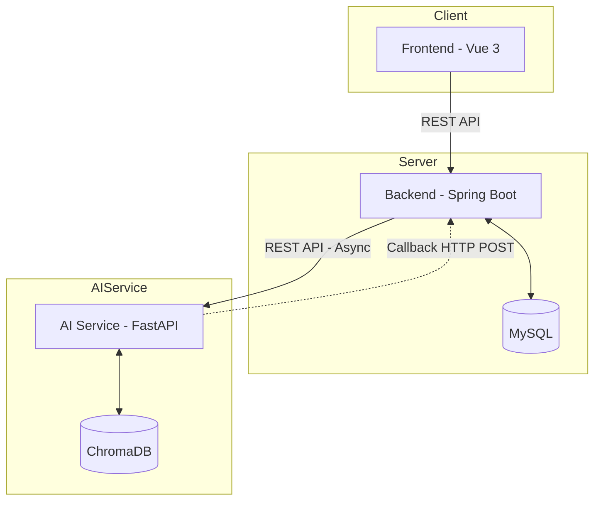

# Feature Spec: 接口通信协议规范 (Interface Communication Protocol)

> Status: Draft
> Version: 1.0
> Date: 2026-03-07

## 1. 概述
为解决前后端、服务端（Backend 与 AI Service）之间频繁出现的通信失败、字段不匹配、状态定义冲突等问题，本文档定义了系统中所有模块间的通信协议标准。

## 2. 核心架构设计


## 3. 通用约定 (Global Rules)

### 3.1 基础架构规则
- **单向请求**: 前端 **禁止** 直接调用 AI Service。所有请求必须经过 Backend。
- **异步解耦**: 耗时任务（如图像生成）必须采用 "提交任务 -> 返回 202 -> 后台处理 -> 回调更新" 的异步模式。
- **状态一致性**: 全系统仅允许使用 `PENDING`, `PROCESSING`, `COMPLETED`, `FAILED` 四种状态枚举。

### 3.2 响应结构 (Response Schema)
Backend 所有 REST 接口统一使用以下结构：
```json
{
  "code": 200,      // 业务状态码 (200: 成功, 4xx: 客户端错, 5xx: 服务端错)
  "message": "...",  // 人类可读的消息描述
  "data": { ... }    // 负载数据，如果成功则存放结果，如果失败可为 null
}
```

### 3.3 认证与授权 (Security)
- **Frontend -> Backend**: 使用 JWT Token (Header: `Authorization: Bearer <token>`)。
- **AI Service -> Backend (Callback)**: 必须在 Header 中携带 `X-Callback-Token`，值由环境变量 `CALLBACK_TOKEN` 指定。

## 4. 接口引用 (Interface References)

| 链路 | 接口规范文件 | 描述 |
|------|-------------|------|
| Frontend -> Backend | [specs/openapi/backend.yaml](../../openapi/backend.yaml) | 定义了用户注册、登录、任务提交、状态轮询接口。 |
| Backend -> AI Service | [specs/openapi/ai-service.yaml](../../openapi/ai-service.yaml) | 定义了异步生成请求、简单同步验证接口。 |
| AI Service -> Backend | [specs/openapi/backend.yaml](../../openapi/backend.yaml) (Callback Endpoint) | 定义了任务执行结果的回调契约。 |

## 5. 前后端通信最佳实践 (Best Practices)
1. **统一 Service 封装**: 前端必须在 `src/services/` 下按模块封装 API 调用，严禁在 UI 组件中散落 `axios.post` 代码。
2. **状态轮询策略**: 对于 `PENDING` 或 `PROCESSING` 状态的任务，前端应以指数退避或固定频率（如 2s）进行轮询请求。
3. **错误处理**: 前端必须实现全局请求拦截器，捕获非 2xx 状态码并弹出 Toast 提示。

## 6. 环境配置要求 (Env Vars)
| 模块 | 变量名 | 必填 | 示例值 | 说明 |
|------|-------|------|-------|------|
| Backend | `AI_SERVICE_URL` | ✅ | `http://ai-service:8000` | AI 服务地址 |
| AI Service | `CALLBACK_URL` | ✅ | `http://backend:8080/api/v1/poetry/callback` | 回调给 Backend 的 URL |
| Both | `CALLBACK_TOKEN` | ✅ | `your-secure-token` | 用于回调校验的共享秘钥 |

## 7. 验收标准
- [ ] 所有新开发的 Controller/Router 接口必须先在对应的 OpenAPI yaml 中定义。
- [ ] 前端类型定义必须完全匹配 OpenAPI 定义的 Schema。
- [ ] 冒烟测试脚本 `ai-service/scripts/smoke_test.py` 必须能够全流程跑通。
- [ ] 回调校验逻辑必须通过单元测试验证。
