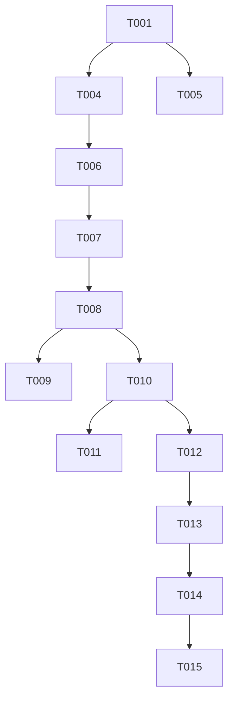

# Tasks: 诗词可视化生成系统 (Interface & Core Logic Alignment)

> Status: IN_PROGRESS
> Reference Plan: [plan.md](../../master/plan.md)
> Reference Spec: [poetry-visualization.spec.md](../poetry-visualization.spec.md)

## Phase 1: Setup & Environment Initialization
项目基础依赖、环境变量以及文档契约的初始化。

- [ ] T001 [P] 导出后端及 AI 服务的 OpenAPI Json 至 `specs/architecture/contracts/`
- [ ] T002 更新配置文件以支持 `CALLBACK_TOKEN` 的全局校验（Backend & AI Service）
- [ ] T003 配置 `backend/src/main/resources/application-dev.yml` 与本地环境变量对齐

## Phase 2: Foundational Tasks (Prerequisites)
核心组件的基石任务，必须在业务逻辑前完成。

- [ ] T004 在 Backend 项目中实现 `X-Callback-Token` 拦截器 `backend/src/main/java/com/poetry/interceptor/CallbackInterceptor.java`
- [ ] T005 定义通用的 `ApiResponse<T>` 泛型类并在控制层全面应用 `backend/src/main/java/com/poetry/dto/ApiResponse.java`

## Phase 3: User Story 4 - 用户注册与登录 [US4]
**Story Goal**: 用户在获得 JWT Token 后才能访问其他功能。
**Independent Test Criteria**: 注册 -> 登录 -> 获取 Token -> 访问受保护接口返回 200。

- [ ] T006 [US4] 创建 `User` 实体与 MyBatis-Plus 的 Mapper 映射 `backend/src/main/java/com/poetry/mapper/UserMapper.java`
- [ ] T007 [US4] 实现 JWT Token 的生成与解析工具类 `backend/src/main/java/com/poetry/util/JwtUtil.java`
- [ ] T008 [US4] 在 `AuthController` 中实现 `/api/v1/auth/register` 与 `/api/v1/auth/login`
- [ ] T009 [P] [US4] 在 Frontend 中更新 `src/services/authService.ts` 处理拦截器逻辑自动附加 Token

## Phase 4: User Story 3 - 核心流程：诗句分镜多图生成 [US3]
**Story Goal**: 核心路径，从诗句输入到多张分镜图异步回传展示。
**Independent Test Criteria**: Frontend 提交诗句，Backend 创建任务，AI Service 后台完成并回调 Backend 更新状态。

- [ ] T010 [US3] 实现后端任务创建接口 `POST /api/v1/poetry/visualize` 并将 PENDING 状态入库
- [ ] T011 [US3] 更新 AI Service 架构以支持异步调用与其对应的 `tasks.py` 后台任务管理器
- [ ] T012 [US3] 在后端实现回调 API `POST /api/v1/poetry/callback` 并校验 Token 与任务状态更新
- [ ] T013 [P] [US3] 前端实现 `src/services/apiService.ts` 到后端 `/api/v1/poetry/visualize` 的对接

## Phase 5: User Story 5 - 历史任务记录浏览 [US5]
**Story Goal**: 用户能够按序浏览本人之前的可视化生成作品。
**Independent Test Criteria**: 登录用户在个人中心可以看到之前生成的历史任务卡片。

- [ ] T014 [US5] 后端实现分页获取当前用户任务记录的逻辑 `GET /api/v1/poetry/history`
- [ ] T015 [P] [US5] 前端实现 `src/views/HistoryView.vue` 和 `src/components/TaskCard.vue`

## Phase 6: Polish & Cross-Cutting Concerns
- [ ] T016 统一全系统的任务状态枚举为 `PENDING/PROCESSING/COMPLETED/FAILED`
- [ ] T017 [P] 移除全项目中散落的硬编码 URL，确保 `ai-service` 的 `callbackUrl` 由环境变量动态注入

## Dependency Graph

## Implementation Strategy
- **MVP Logic**: 绝大多数工作量集中在异步回调与认证对接，这是解决当前“通信失败”风险的关键点。
- **Contract First**: 所有 Controller 修改必须先读 `backend.yaml` 原定义。
- **Security**: 确保 T004 的回调 Token 逻辑被优先实现，防止 AI 结果被非法注入。
