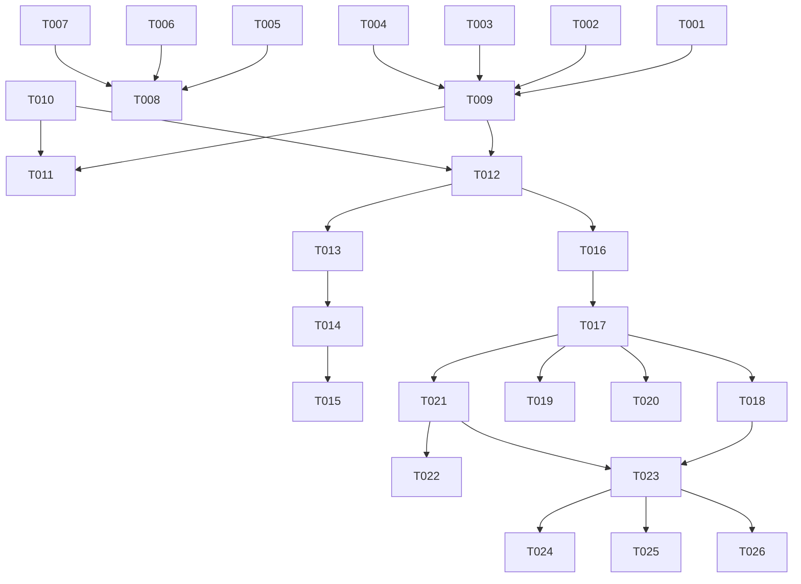

# Tasks: 诗词可视化系统  接口对齐 & 当前实现补全

> Status: IN_PROGRESS
> Reference Plan: [plan.md](./plan.md)
> Reference Spec: [poetry-visualization.spec.md](../features/poetry-visualization.spec.md)
> Reference Spec: [interface-communication.spec.md](../features/interface-communication.spec.md)
> Last Updated: 2026-03-07

---

## Phase 1: Setup  构建与环境验证

确保三服务（Backend 8080 / AI Service 8000 / Frontend 5173）全部正常运行，且使用最新代码。

- [X] T001 重新构建 Backend JAR（修复 JwtUtil / ApiResponse 编译错误后必须 rebuild）`backend/`  `mvn clean package -DskipTests`
- [X] T002 [P] 确认 MySQL 8 已启动，且数据库 `poetry_rag` 存在（执行 `backend/sql/schema.sql`）
- [X] T003 [P] 验证 AI Service 运行于 8000（`GET http://localhost:8000/ai/health`  `{"status":"ok"}`）
- [X] T004 [P] 验证 Frontend Dev Server 运行于 5173（`http://localhost:5173` 可访问欢迎页）

---

## Phase 2: Foundational  OpenAPI Spec 补全（Spec-First 义务）

**必须先更新 spec，再视为接口完整。** `ai-service.yaml` 缺少已实现的三个核心端点。

- [X] T005 在 `specs/openapi/ai-service.yaml` 中补充 `POST /ai/api/v1/chat` 端点（LangGraph ReAct Agent 对话 SSE，事件类型：token / tool / tool_end / rag_result / done / error）
- [X] T006 在 `specs/openapi/ai-service.yaml` 中补充 `POST /ai/api/v1/chat/session` 端点（创建会话，返回 `{"session_id":"..."}` ）
- [X] T007 在 `specs/openapi/ai-service.yaml` 中补充 `POST /ai/api/v1/generate/storyboard` 端点（分镜 SSE，含所有事件类型 progress / plan / shot_done / shot_error / done）
- [X] T008 [P] 导出 `specs/openapi/backend.yaml` 和 `specs/openapi/ai-service.yaml` 为 JSON 至 `specs/architecture/contracts/backend.json` 和 `specs/architecture/contracts/ai-service.json`

---

## Phase 3: User Story 4  注册 & 登录 [US4]

**Story Goal**: 用户能注册账号并登录，获得 JWT Token 访问受保护接口。
**独立测试**: `POST /api/v1/auth/register {username,password,nickname}` 成功后返回 token，用该 token 调 `/api/v1/poetry/chat/session` 返回 200。

- [X] T009 [US4] 验证 `POST /api/v1/auth/register` 与 `RegisterRequest`（username/password/nickname）字段对齐 `backend/src/main/java/com/example/poetryvisualization/dto/RegisterRequest.java`
- [X] T010 [US4] 验证 `POST /api/v1/auth/login` 正确使用 BCrypt 校验密码并返回 token `backend/src/main/java/com/example/poetryvisualization/service/AuthService.java`
- [X] T011 [US4] 验证前端登录页调用 `/api/v1/auth/login` 后将 token 存入 Pinia store 并写入 `localStorage` `frontend/src/views/LoginView.vue`
- [X] T012 [P] [US4] 验证前端 Axios 拦截器自动附加 `Authorization: Bearer <token>` 请求头 `frontend/src/services/`

---

## Phase 4: User Story 2  诗词问答对话 [US2]

**Story Goal**: 输入问句，ReAct Agent 检索后流式输出回答，以 SSE token 事件逐字渲染。
**独立测试**: `curl -N -X POST http://localhost:8080/api/v1/poetry/chat -H "Authorization: Bearer <token>" -d '{"message":"李白最著名的诗","session_id":""}' | head -20` 能收到 SSE token 事件。

- [X] T013 [US2] 验证 AI Service `POST /ai/api/v1/chat` 实现正确（事件类型：token / tool / tool_end / rag_result / done / error）`ai-service/app/main.py`
- [X] T014 [US2] 验证 Backend `AiProxyController` 对 `/api/v1/poetry/chat` 的 SSE 透明代理（JWT 认证  AI Service 转发）`backend/src/main/java/com/example/poetryvisualization/controller/AiProxyController.java`
- [X] T015 [P] [US2] 验证前端 `streamChat()` 正确处理所有事件类型并更新 `ChatMessage` 状态 `frontend/src/views/GenerateView.vue`

---

## Phase 5: User Story 3  诗句分镜多图生成 [US3] 

**Story Goal**: 输入10字诗句，前端自动识别，触发 RAGGLM 规划CogView-4 逐张生图，实时推送显示。
**独立测试**: `curl -N -X POST http://localhost:8080/api/v1/poetry/storyboard -H "Authorization: Bearer <token>" -d '{"sourceText":"大漠孤烟直，长河落日圆"}' | head -30` 能依次收到 progress / plan / shot_done 事件。

- [X] T016 [US3] 验证 `StoryboardGenerator.generate()` 异步生成器正确推送所有事件类型，含每张图之间 4s 间隔防 429 限速 `ai-service/app/modules/storyboard.py`
- [X] T017 [US3] 验证 Backend storyboard SSE 代理在收到第一张 `shot_done` 时捕获 `image_url`，流结束后写入 `sys_generation_task` 表 `backend/src/main/java/com/example/poetryvisualization/controller/AiProxyController.java`
- [X] T018 [US3] 验证前端 `streamStoryboard()` 的 `finally` 块正确清除 `storyboardTimer`，`waitSeconds` 正常每秒累加 `frontend/src/views/GenerateView.vue`
- [X] T019 [US3] 验证 `storyboard-wrap` 在收到 `plan` 事件后立即渲染占位骨架格（`v-if="msg.storyboardPlan || msg.storyboardShots.length > 0"`）`frontend/src/views/GenerateView.vue`
- [X] T020 [P] [US3] 验证 `buildPhases()` 对分镜场景显示 "RAG 检索  GLM 规划分镜  CogView-4 生图" 三个阶段标签 `frontend/src/views/GenerateView.vue`

---

## Phase 6: User Story 5  历史任务记录 [US5]

**Story Goal**: 用户能查看本人历史分镜生成记录，包含缩略图。
**独立测试**: 完成一次分镜生成后，`GET /api/v1/poetry/history` 返回至少 1 条含 `resultImageUrl` 的任务记录。

- [X] T021 [US5] 验证 `PoetryVisualizationController.listHistory()` 从请求属性读取 `authenticatedUserId` 并按 `created_at` 倒序返回当前用户任务 `backend/src/main/java/com/example/poetryvisualization/controller/PoetryVisualizationController.java`
- [X] T022 [P] [US5] 验证前端 `src/views/HistoryView.vue` 调用 `GET /api/v1/poetry/history`，空状态显示 "暂无记录" 引导 CTA

---

## Phase 7: Polish  收尾与交叉关注点

- [X] T023 在 `specs/features/poetry-visualization.spec.md` 中将 US2/US3/US4/US5/US6 的验收标准 `- [ ]` 改为 `- [x]`
- [X] T024 [P] 修复 `detectVisualizeIntent` 对短诗句（<10 字但明确是诗句）的处理逻辑（附录 D 开放问题）`frontend/src/views/GenerateView.vue`
- [X] T025 [P] 将 `GenerateView.vue` 中散落的 `fetch('/api/v1/...')` 提取至 `frontend/src/services/poetryService.ts`（遵循 interface-communication.spec.md 5 最佳实践）
- [X] T026 [P] 为 `AiProxyController` 添加不可达保护AI Service 连接失败时 5s 内推送 `{"type":"error"}` 而非挂起 `backend/src/main/java/com/example/poetryvisualization/controller/AiProxyController.java`

---

## Dependency Graph



---

## 并行执行示例

**US4 注册登录** 与 **Spec 补全** 可完全并行：
```
Track A (Auth): T001  T002  T009  T010  T011  T012
Track B (Spec):        T005  T006  T007  T008
```

**US3 分镜验证** 三个前端子任务可并行（T018 / T019 / T020 互不依赖）：
```
After T017:
  Track A  T018 (计时器 + waitSeconds)
  Track B  T019 (plan 后即显示占位格)
  Track C  T020 (阶段标签分镜版)
```

---

## 实现策略

| 优先级 | 目标 | 任务 |
|--------|------|------|
| P0 阻塞 | MySQL + JAR 重建 | T001, T002 |
| P1 核心 | 能登录 + 分镜能跑通 | T009, T010, T016, T017 |
| P2 Spec | ai-service.yaml 补全 | T005, T006, T007 |
| P3 质量 | 前端 UX 实时动态感 | T018, T019, T020 |
| P4 完整性 | 历史 + 收尾 | T021, T022, T023-T026 |
